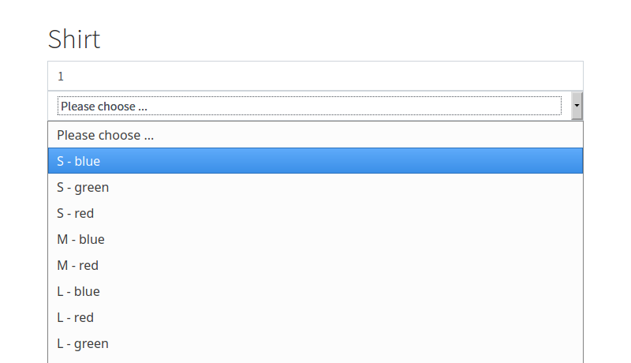
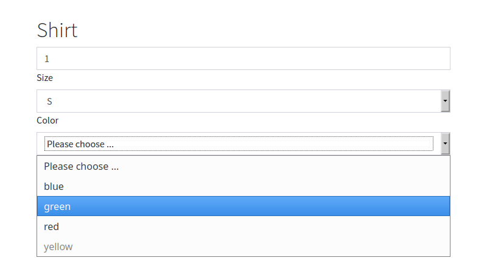

.. include:: ../../Includes.rst.txt

.. _variants-multiple-selector:

=======================================
Multiple selectors for backend variants
=======================================

When using multiple backend variants (for a t-shirt: size and color) the default
output in the frontend is not really user friendly because all available
combinations are rendered in a single selector field as shown in the following
image:

   Default: Single selector for all available combinations.

By including some JavaScript that comes with EXT:cart_product you can enable
a more user-friendly version where every BackendVariant has its own selector
field. The JavaScript ensures that only available combinations can be chosen
by the customer.

   Adapted: Every BackendVariant has its own selector field.

..  note::
    At the moment it only works for two BackendVariants, not with three!

Integration
===========

Create in your extension (e.g. your `EXT:sitepackage`) an overwrite of
`EXT:cart_products/Resources/Private/Partials/Products/CartForm.html`.

Then you add the snippet as shown below:

.. code-block:: html
   :caption: EXT:sitepackage/Resources/Private/Cart/Partials/Products/CartForm.html

    ...

    <f:if condition="{product.beVariants}">
        <f:asset.script identifier="multi-selector" src="EXT:cart_products/Resources/Public/JavaScripts/cart.js" />

        ...
